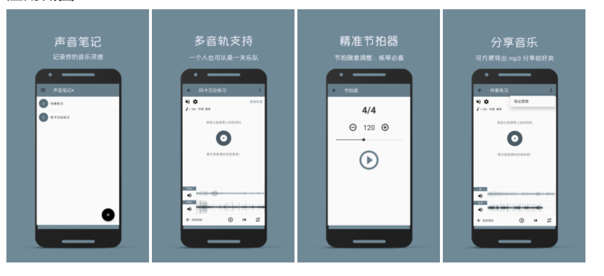

# About

A side app just for fun. Maybe you can use it for improvisation or ensemble practice.

一个slide app，你也许可以用它来进行合奏或者即兴练习(逃...)。

# Feature

1. support multi-track recording and playback.
2. a byte-accurate metronome inside.
3. acc format audio output.

1. 支持多音轨录音和播放
2. 一个字节级别精准的节拍器
3. ACC 格式音频压缩导出

# Screenshots

# Download And Check

[豌豆荚](https://www.wandoujia.com/apps/com.cmajor.musicnote?from=singlemessage)

# Contact Me

A freelancer. If you want to develop an app / website / 小程序，you can consider me. [learn more...](https://yedaxia.pro/cooperate)

**Contact:**

- email: yedaxia#foxmail.com (# to @)

最近比较缺钱，在接一些项目做，如果你有开发 app/网站/小程序 的需求，你或许可以考虑一下找我。[了解更多...](https://yedaxia.pro/cooperate)

**联系我：**

- email: yedaxia#foxmail.com (# to @)
- 技术交流群：70948803（TechChat）
